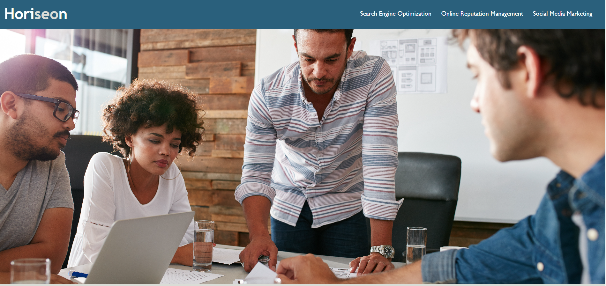

# Horiseon
 Horiseon Challenge

 Helping a company develop a more accessible friendly webpage by consolidating CSS and used semantic elemets to replace divs to give a better description within the HTML and also added alt images for people with impared vision.

